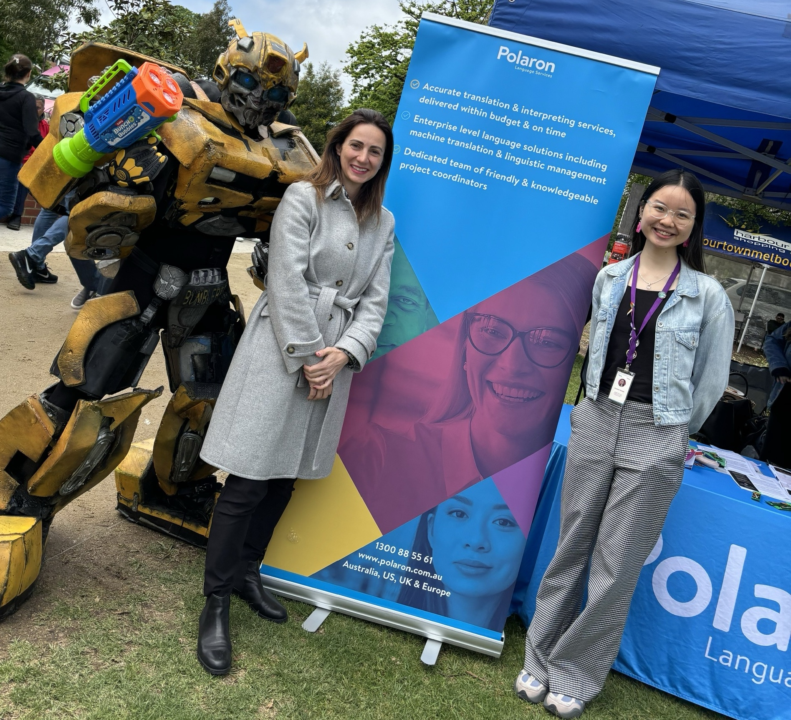
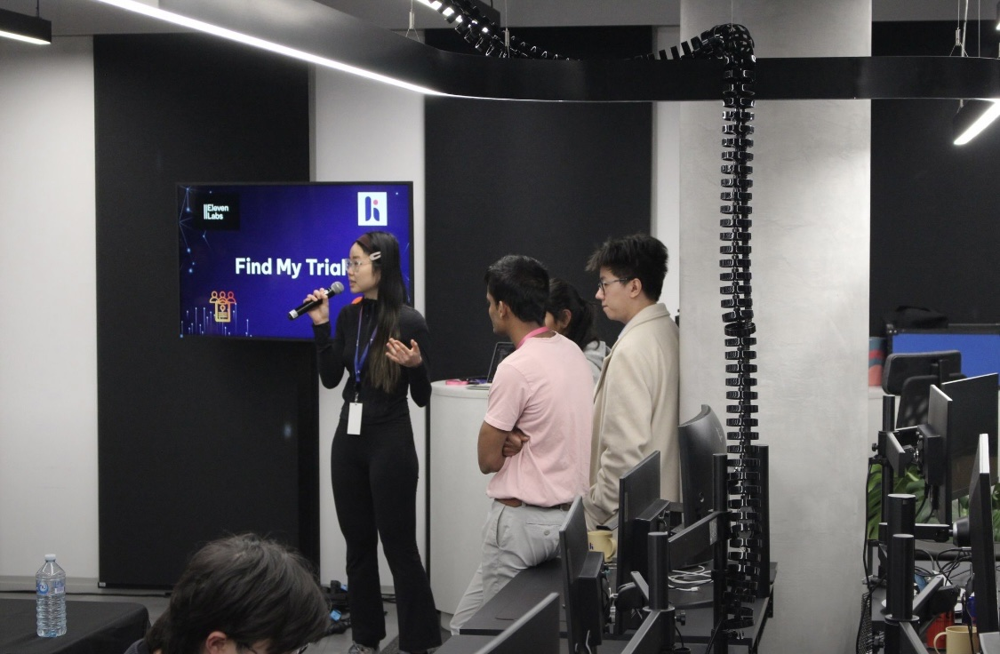

## Speaking & Volunteering
### From volunteer...
- While at Monash, I volunteered at four Open Days during studies, speaking to prospective students and providing course advice:

### ...to alumni speaker!
- In a full-circle moment, I was invited back to Monash to share my career journey and student experience as a Media Communication alumna:

### Global Ambassador
- As the proud Global Ambassador of Monash, I worked with the International Student Engagement team to organise events for students as well as team members through the aims of four core pillars - Development, Networking, Publicity, and Wellbeing.
- Here, I'm speaking to commencing international students at the [Pre-arrival briefing](https://www.youtube.com/watch?v=OeC-_j14-IQ):

## Media presence
### Filming for course introduction video 
- I represented the Bachelor of Media Communication (BMC) program in the Meet Monash series:
<YouTube youTubeId="C7FaJyHDZUs" />

## Community engagement 
Here are some examples of my community presence:

With Cr Lana Formoso, City of Greator Dandenong, at the Fiji Day Multicultural Festival, celebrating the Independence Day of Fiji
 

Representing Polaron at the EOY event hosted by the Australia-China Young Professionals Initiative (ACYPI). Here I'm with ACYPI President, Judy Gao
 

Celebrating Lunar New Year at a local community event, hosted by 聊聊家常
 

I'm part of the active network of Australia Latam Emerging Leaders Dialogue (ALELD), a non-profit organisation dedicated to strengthening relationship between Australia and Latin America
 

Representing Polaron and contributing at the first event of Australian Professionals of Multicultural Communities (APOC), an emerging community organisation dedicated to supporting multicultural professionals
 

Helping the Polaron crew at the Community Information Session on Protection visas, hosted in collaboration with the Department of Home Affairs, speaking to the community about the new changes to Protection visas and available assets in 19 languages
 

I loved organising Polaron's monthly Lunch and Learn, dedicated to bringing organisations and communities together for discussions on pressing issues. Here is one in June, in collaboration with Max Solutions, on education and workforce freedom
 

With my colleague and Nour Haydar, Host and Senior Producer at The Guardian, at “The Man Question: Engaging Migrant and Refugee Men in Gendered Violence Prevention” by Multicultural Centre for Women's Health
 

Representing Polaron at the Melbourne Marketing Forum. I had the pleasure of connecting with Simon Tran and the team from ANGRYChair, who spoke creatively and inspiringly about the future of video production in the age of AI.
 

With the amazing committee of Monash Media Communication Society (MACS) – the firstever student society dedicated to media, film, and journalism students
 

On a different note, I'm very into tech! Here's me speaking on my team's work at Heidi Health's hackathon
 

