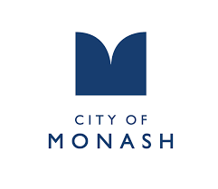
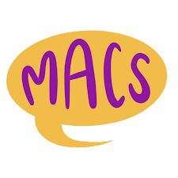
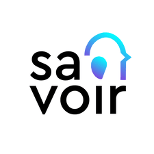
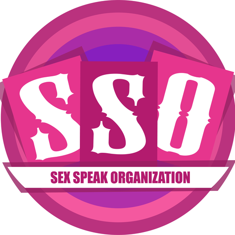

## Work experience

  

    
    

      

        
Marketing & Technology Specialist

        
July 2025 – now

      

      
Hai Ha Education

    

  

  <a href="https://haihasg.com/" class="underline text-sm mt-1 inline-block">Link to website</a>

  <ul class="mt-3 space-y-1 text-left list-square list-inside">
    <li>Led the development of innovative digital products that enhance the learning experience, such as an e-learning platform and online multimedia resources</li>
    <li>Developed go-to-market strategies and promotional campaigns to increase client retention, drive adoption and engagement for new e-products</li>
  </ul>

  

    
    

      

        
Marketing & Communications Coordinator

        
Sep 2024 – Jul 2025

      

      
Polaron Connect

    

  

  <a href="https://polaron.org/" class="underline text-sm mt-1 inline-block">Link to website</a>

  <ul class="mt-3 space-y-1 text-left list-square list-inside">
    <li>Project managed the rebranding to Polaron Connect, leading the website launch and comprehensive branding change</li>
    <li>Delivered high-impact marketing campaigns and content, driving business growth and engagement</li>
    <li>Transitioned in mid-July to an Independent Contractor role, continuing to work on projects while pursuing further studies and opportunities.</li>
  </ul>

  

    
    

      

        
Sustainability Communications Intern & Food Waste Feedback Officer

        
Feb 2024 - Sep 2024

      

      
City of Monash

    

  

  <a href="https://www.monash.vic.gov.au/Home" class="underline text-sm mt-1 inline-block">Link to website</a>

  <ul class="mt-3 space-y-1 text-left list-square list-inside">
    <li>Developed sustainability newsletters, web content, collaterals and events</li>
    <li>Directly supported residents with food waste recycling via door-to-door engagement</li>
    <li>Generated insights reports to identify gaps and refine the Council’s engagement strategies</li>
  </ul>

  

    
    

      

        
Communications Officer

        
Dec 2023 – Jul 2024

      

      
Office of the Deputy Vice-Chancellor (Research) - Monash University

    

  

  <a href="https://www.monash.edu/research/our-research" class="underline text-sm mt-1 inline-block">Link to website</a>

  <ul class="mt-3 space-y-1 text-left list-square list-inside">
    <li>Amplified research impact through writing grants, award and partnership stories, internal newsletters, speeches and web content</li>
  </ul>

  

    
    

      

        
PR & Communications Intern (Government stream)

        
Jul 2023 – Sep 2023

      

      
alt/shift

    

  

  <a href="https://altshift.com.au/" class="underline text-sm mt-1 inline-block">Link to website</a>

  <ul class="mt-3 space-y-1 text-left list-square list-inside">
    <li>Developed and delivered strategic PR and communications campaigns for government clients spanning media relations, content creation and community engagement</li>
    <li>Key campaigns: FOGO (Sustainability Victoria), Kinder Program (Department of Education), Split Second Competition (Transport Accident Commission)</li>
  </ul>

  

    
    

      

        
Archival Research and Communications Officer

        
Feb 2023 – June 2023

      

      
Monash University

    

  

  <a href="https://www.monash.edu/library" class="underline text-sm mt-1 inline-block">Link to website</a>

  <ul class="mt-3 space-y-1 text-left list-square list-inside">
    <li>Promoted the Library's content, collections and events through social media channels</li>
    <li>Optimised engagement rate by 16.9% through data-driven insights, strategy and planning</li>
  </ul>

## Education

    

      
      

        

          
Bachelor of Media Communication

          
Oct 2022 – Sep 2024

        

        
Monash University

      

    

<a href="https://www.monash.edu/study/courses/bachelor-of-media-communication-a2001" class="underline text-sm mt-1 inline-block">Link to course</a>

<ul class="mt-3 space-y-1 text-left list-square list-inside">
      <li>Specialisations: Media, Journalism</li>
      <li>GPA: 3.84</li>
      <li>Academic Excellence Award: Best Overall Student in the Bachelor of Media Communication</li>
</ul>

## Extracurriculars

    
    

    

        
Marketing Subcommittee Member & PIVOT Writer

        
Jul 2023 – Feb 2025

    

    
Monash International Affairs Society (MIAS)

    

<a href="https://monashias.com/" class="underline text-sm mt-1 inline-block">Link to website</a>

<ul class="mt-3 space-y-1 text-left list-square list-inside">
    <li>Attended and helped facilitate MIAS’ events (networking night, diplomatic GALA night, and workshops featuring prominent industry speakers)</li>
    <li>Managed MIAS’ social media channels</li>
    <li>Wrote articles on international affairs for PIVOT, MIAS’ publication. Explore at: <a href="https://pivot.mias.org.au/2024/11/01/artificial-is-the-new-reality-how-ai-is-changing-elections-in-2024/" target="_blank" rel="noopener noreferrer">Article 1</a>, <a href="https://pivot.mias.org.au/2024/04/30/how-special-was-the-asean-australian-special-summit-2024/" target="_blank" rel="noopener noreferrer">Article 2</a>, <a href="https://pivot.mias.org.au/2023/11/07/spains-election-results-and-the-rise-of-europes-far-right/" target="_blank" rel="noopener noreferrer">Article 3</a></li>
</ul>

    
    

    

        
General Committee Member

        
Jun 2022 – Jul 2024

    

    
Monash Media and Communication Society (MACS)

    

<a href="https://www.monashmacs.com/" class="underline text-sm mt-1 inline-block">Link to website</a>

<ul class="mt-3 space-y-1 text-left list-square list-inside">
    <li>Key stakeholder</li>
    <li>Produced and featured in MACS’ podcast, MACS Chats. Explore at: <a href="https://open.spotify.com/episode/1xEnmOdWqCjpqEcgpStQcI?si=da1456098c4f41ca" target="_blank" rel="noopener noreferrer">S5 Ep 5</a>, <a href="https://open.spotify.com/episode/7aHYP68CZ08RC1pjxg7NhD?si=78a69fa2bd5b4c3d" target="_blank" rel="noopener noreferrer">S3 Ep 2</a>, <a href="https://open.spotify.com/episode/7m9sdGaVieOK1hv9Ju3I2n?si=59a7c515861b417c" target="_blank" rel="noopener noreferrer">S2 Ep 2</a></li>
</ul>

    
    

    

        
Marketing Officer

        
Jun 2022 – Dec 2022

    

    
Monash Association of Coding (MAC)

    

<a href="https://www.monashcoding.com/" class="underline text-sm mt-1 inline-block">Link to website</a>

<ul class="mt-3 space-y-1 text-left list-square list-inside">
    <li>Managed MAC’s social media channels and helped facilitate events and workshops</li>
</ul>

## Volunteering

    
    

    

        
Global Ambassador

        
Feb 2022 – Dec 2022

    

    
Monash University

    

<a href="https://www.monash.edu/study/international-students/why-monash/global-ambassadors" class="underline text-sm mt-1 inline-block">Link to website</a>

<ul class="mt-3 space-y-1 text-left list-square list-inside">
    <li>Supported the International Student Engagement team in organising events and initiatives across development, networking, publicity and wellbeing, including orientations, webinars, peer support programs and student conferences.</li>
</ul>

    
    

    

        
Social Media Ambassador

        
Oct 2021 – Jul 2024

    

    
Monash University

    

<a href="https://www.monash.edu/study/experience-monash/student-life/social-media-ambassadors" class="underline text-sm mt-1 inline-block">Link to website</a>

<ul class="mt-3 space-y-1 text-left list-square list-inside">
    <li>Created engaging content for Monash Arts's social media platforms</li>
</ul>

    
    

    

        
Co-Founder & Content Writer

        
Oct 2019 – Sep 2021

    

    
Savoir Project

    

<a href="https://www.facebook.com/savoirproject" class="underline text-sm mt-1 inline-block">Link to website</a>

<ul class="mt-3 space-y-1 text-left list-square list-inside">
    <li>Co-founded an educational initiative and produced informative content on media and literature</li>
</ul>

    
    

    

        
Content Writer

        
Aug 2019 – Apr 2021

    

    
Sex Speak Organization

    

<a href="https://www.facebook.com/SSO.VN" class="underline text-sm mt-1 inline-block">Link to website</a>

<ul class="mt-3 space-y-1 text-left list-square list-inside">
    <li>Wrote educational content on sex education, aiming at increasing awareness among Vietnamese youth</li>
</ul>

## Skills

    <ul class="mt-3 space-y-1 text-left list-square list-inside">
      <li><strong>Marketing:</strong> Branding, Data Analysis, Content Creation, Copywriting, Email Marketing</li>
      <li><strong>Digital tools:</strong> Google Analytics, HubSpot, Zoho CRM, WordPress, MailChimp, Adobe Creative Suite</li>
      <li><strong>Programming & Libraries:</strong> Python, HTML/CSS, Java, JavaScript, R, Pandas, NumPy, Matplotlib</li>
      <li><strong>Languages:</strong> English (fluent), Vietnamese (native), Spanish (C1), Mandarin (B1), Portuguese (A2)</li>
    </ul>
  
